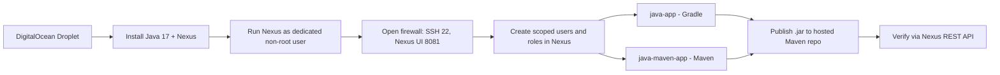

# Nexus Repository Manager on DigitalOcean

Self-hosted an artifact repository from scratch: provisioned the server, secured it, configured access control, and published Java build artifacts to it from two different build tools, then verified everything through the REST API instead of just eyeballing the UI.

**Note on context:** This is hands-on lab work from the TechWorld with Nana DevOps bootcamp (Module 6). The two demo Java apps in this repo (`java-app`, `java-maven-app`) are course-provided scaffolding I used to exercise the publishing workflow, not original applications. I'd rather be upfront about that than have it look like more than it is. Everything else here, the server setup, the security configuration, the artifact management, I did myself and can walk through in an interview.

## Why This Exists

Every team that builds software needs somewhere to store the things it builds, compiled `.jar` files, Docker images, npm packages, with version history, access control, and cleanup policies so it doesn't grow forever. Nexus is one of the standard tools for that. This project was my way of understanding artifact management from the infrastructure side, not just consuming someone else's Artifactory instance.


## Workflow



## What I Did

**1. Server setup**
Provisioned a DigitalOcean droplet sized for Nexus's memory footprint (it's heavier than most of the other services I've run), attached a firewall, and opened only the ports actually needed: 22 for SSH, 8081 for the Nexus UI.

**2. Installed the runtime**
Installed Java 17 (a hard requirement for the Nexus version I used) and downloaded/extracted Nexus into `/opt`. This produces two directories worth understanding: `nexus-<version>` (the application binaries, replaceable on upgrade) and `sonatype-work` (the persistent data: repos, logs, plugins, config, the thing you'd actually back up).

**3. Locked down the service account**
Nexus should never run as root. I created a dedicated `nexus` system user, transferred ownership of both directories to it, and set `run_as_user="nexus"` in `nexus.rc` so the service starts under that account by default, not something I have to remember to do manually every time.

**4. Verified and logged in**
Started Nexus, confirmed it was actually listening with `netstat -lntp`, then logged into the web UI using the auto-generated initial admin password pulled from `sonatype-work/nexus3/admin.password`. Rotated it immediately on first login.

**5. Access control, not just the admin account**
Rather than handing out admin credentials to "users" (even test ones), I created dedicated roles scoped to specific repositories under Security > Roles, then created users and attached those roles. This is the same least-privilege pattern you'd want on a real team, just at a scale of one.

**6. Published artifacts from two build tools**
Gradle (`java-app`): Added the `maven-publish` plugin, configured it to package `build/libs/my-app-$version.jar` and push it to the Nexus-hosted Maven repo. Since the repo runs on HTTP (not HTTPS) in this lab, I had to explicitly set `allowInsecureProtocol = true`, and I made sure credentials came from `gradle.properties` (gitignored), never hardcoded in `build.gradle`, since that file gets committed.
Maven (`java-maven-app`): Same idea, different mechanics, added the `maven-deploy-plugin`, pointed `distributionManagement` in `pom.xml` at the Nexus snapshot repo, and stored credentials in `~/.m2/settings.xml` where the server id has to match what's referenced in `pom.xml`.

**7. Verified through the API, not just the UI**
After each publish, I queried the Nexus REST API directly with `curl` (`/service/rest/v1/repositories`, `/service/rest/v1/components`) to confirm the artifact actually landed where it should, the same kind of check you'd script into a CI pipeline rather than checking by hand every time.

**8. Understood the storage model**
Worked through blob stores (where the actual bytes live, local disk here, could be S3), the distinction between a component (the logical published package) and its assets (the individual files under it), and how cleanup policies keep old snapshots from accumulating indefinitely.

## Skills Demonstrated

Linux server provisioning and administration, security hardening through dedicated non-root service accounts and least-privilege role design, firewall and network access control, secrets management (externalized, gitignored credentials rather than hardcoded values), build tool configuration in both Gradle (`build.gradle`, `settings.gradle`) and Maven (`pom.xml`), artifact repository concepts like blob storage and components vs. assets, REST API usage for verification and automation, and technical documentation.

## Repo Structure

```
.
├── java-app/         # Gradle-based demo app, publishes via maven-publish
├── java-maven-app/   # Maven-based demo app, publishes via maven-deploy-plugin
└── README.md
```

## Key Commands

```bash
# Server
chown -R nexus:nexus /opt/nexus-3.91.1-04 /opt/sonatype-work
/opt/nexus-3.91.1-04/bin/nexus start
netstat -lntp

# Gradle
gradle build
gradle publish

# Maven
mvn package
mvn deploy

# Verify
curl -u user:password -X GET 'http://<nexus-ip>:8081/service/rest/v1/repositories'
```
